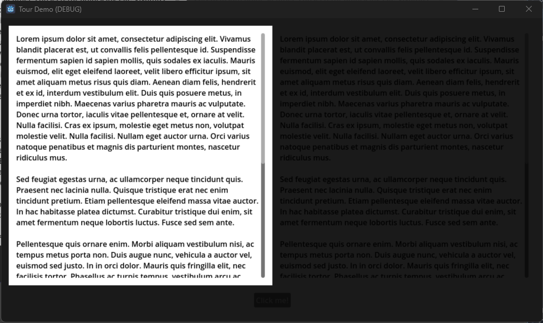
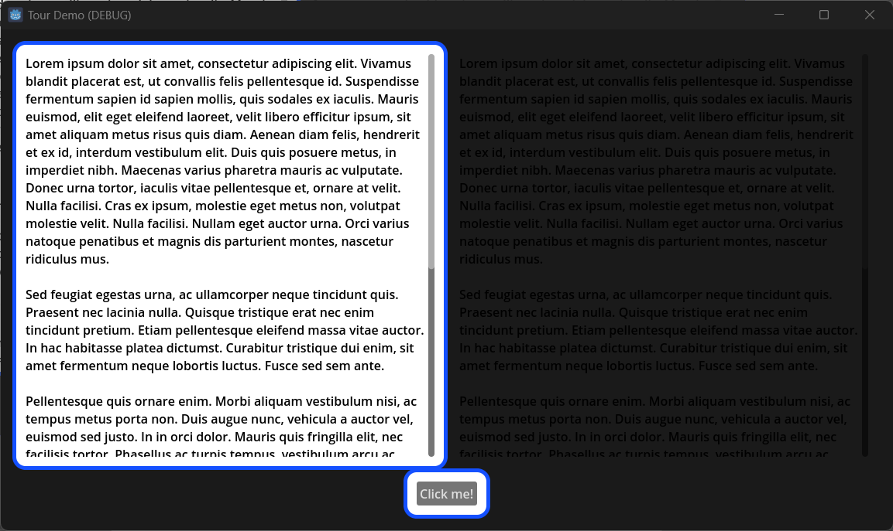
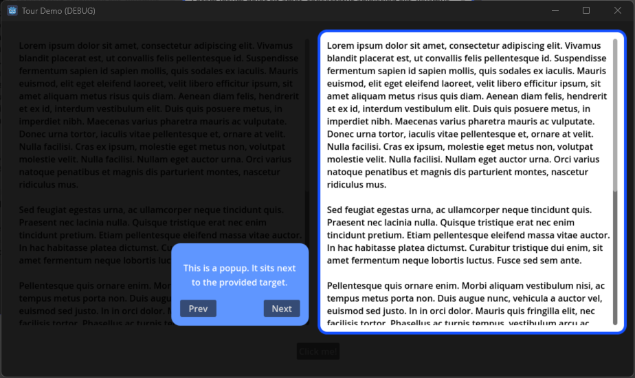
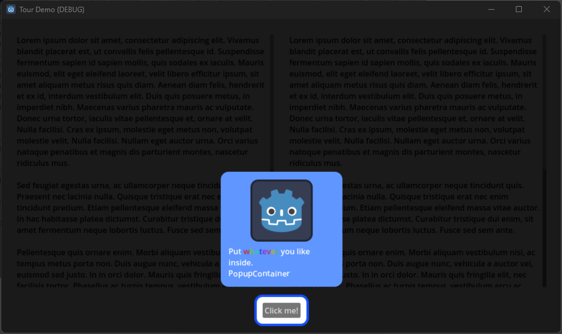

# Godot Tour
A GDExtension built with Rust, using [gdext](https://github.com/godot-rust/gdext).

## Description
Provides functionality to implement things like UI tours.

## Available Nodes
### `TheaterRect`
Focus the users attention on any number of `Control`'s. 
#### Features
- Toggle the ability to prevent mouse input outside of the focused region.
<table>
  <tr>
    <td></td>
    <td></td>
  </tr>
</table>

### `PopupContainer`
Moves next to a target `Control`. 
#### Features
- Provide your own `Control`. Let the container handle positioning.
- Toggle `Smart Positioning`. The popup will try to stay on-screen.
<table>
  <tr>
    <td></td>
    <td></td>
  </tr>
</table>