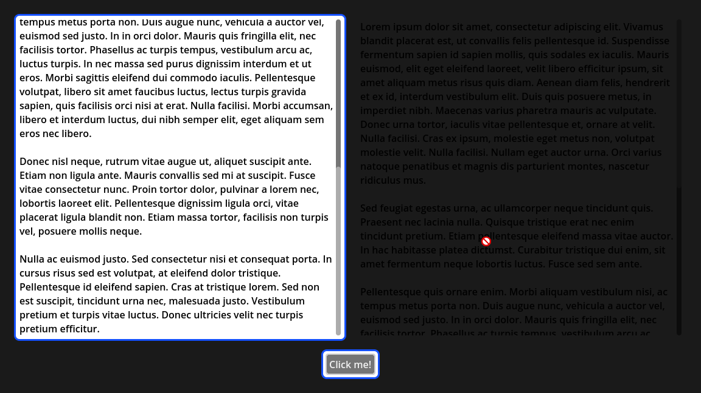

# Godot Tour
A GDExtension built with Rust, using [gdext](https://github.com/godot-rust/gdext).

## Description
Provides functionality to implement things like UI tours.

## Available Nodes
### `TheaterRect`
Focus the users attention on a particular `Control`. 
Use the built-in `RefrenceRect` to outline the focused `Control`.
<table>
  <tr>
    <td></td>
    <td></td>
  </tr>
</table>