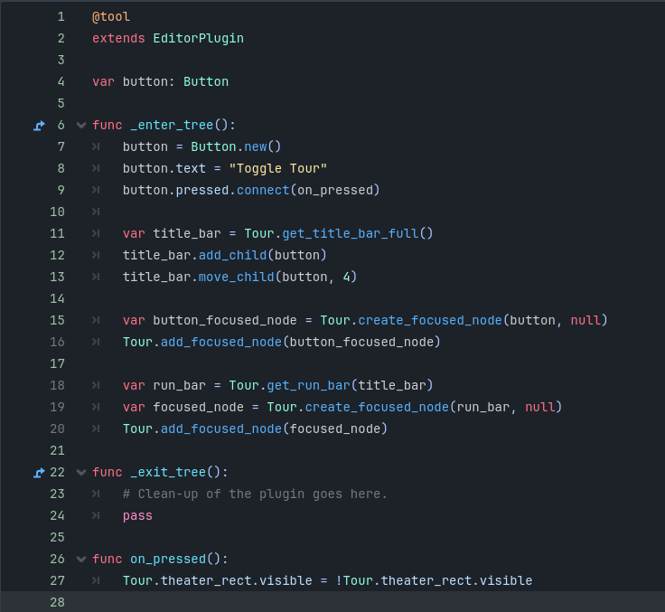
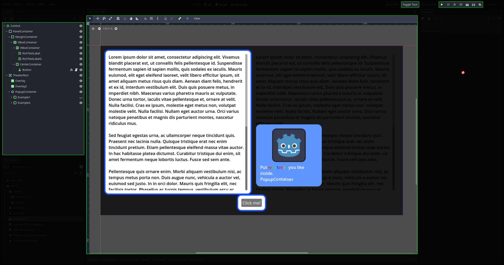

# Godot Tour
A GDExtension built with Rust, using [gdext](https://github.com/godot-rust/gdext).

## Description
Provides functionality to implement things like UI tours.

## Available Nodes
### `TheaterRect`

- Focus the users attention on any number of `Control` 's.
- Prevent mouse input outside of the focused region.

### `PopupContainer`

- Provide your own `Control` and let the container handle positioning.
- Toggle `Smart Positioning` for the popup to stay on-screen.

## Singletons
### `TourSingleton`
- Adds ability to script editor tours.
- Provides utilities for interacting with the editor UI.

## Resources
### `FocusedNode`
- `target` The control to focus on.
- `overlay` The panel to use as an overlay.

## Notes from development.
- If the the `Panel` does not have a stylebox override, and you try and change values on it, it will cause an error.
  - Something about multiple binds which `gdext` will panic on.
  - So only change values on overridden styleboxes.